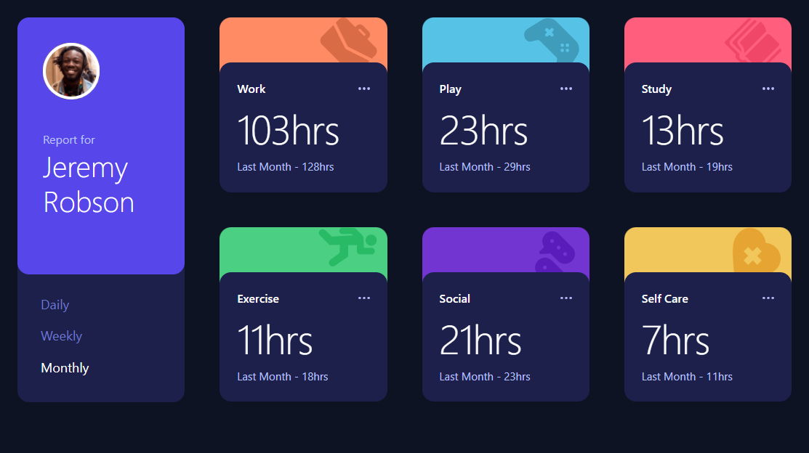
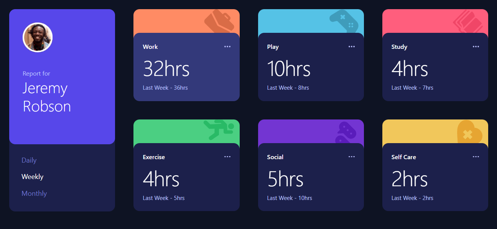
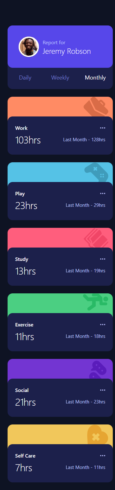

# Frontend Mentor - Time tracking dashboard solution

This is a solution to the [Time tracking dashboard challenge on Frontend Mentor](https://www.frontendmentor.io/challenges/time-tracking-dashboard-UIQ7167Jw). Frontend Mentor challenges help you improve your coding skills by building realistic projects. 

View the project live at https://kpessa.github.io/fem-time-tracker/.

## Table of contents

- [Frontend Mentor - Time tracking dashboard solution](#frontend-mentor---time-tracking-dashboard-solution)
  - [Table of contents](#table-of-contents)
  - [Overview](#overview)
    - [The challenge](#the-challenge)
    - [Screenshots](#screenshots)
      - [Desktop](#desktop)
      - [Desktop - Hover / Weekly](#desktop---hover--weekly)
      - [Mobile](#mobile)
    - [Links](#links)
  - [My process](#my-process)
    - [Built with](#built-with)
    - [What I learned](#what-i-learned)
    - [Continued development](#continued-development)
    - [Useful resources](#useful-resources)
  - [Author](#author)
  - [Acknowledgments](#acknowledgments)

**Note: Delete this note and update the table of contents based on what sections you keep.**

## Overview

### The challenge

Users should be able to:

- View the optimal layout for the site depending on their device's screen size
- See hover states for all interactive elements on the page
- Switch between viewing Daily, Weekly, and Monthly stats

### Screenshots

#### Desktop



#### Desktop - Hover / Weekly



#### Mobile




### Links

- Solution URL: [Solution URL here](https://github.com/kpessa/fem-time-tracker)
- Live Site URL: [Live site URL here](https://kpessa.github.io/fem-time-tracker/)

## My process

### Built with

- Semantic HTML5 markup
- CSS custom properties
- Flexbox
- CSS Grid
- Mobile-first workflow
- [React](https://reactjs.org/) - JS library
- [TailwindCSS](https://tailwindcss.com/) - For styles

### What I learned

On this project, I learned more about using Figma as a design tool.  To start out, I used codepen.io to get refamiliarized with CSS grid.  I then started to use react to build out a card component.  I realized that I wanted to use a styling library, and TailwindCSS was the styling tool that I think made the code a lot cleaner. 

I was pround of the DRY ('Don't repeat yourself') App.js section:
- I was able to accumulate all the props I needed to pass down to the card compoments from the json file and added background colors and icons!

```js
export default function App() {
	const [time, setTime] = useState('weekly');

	let bgColors = ['#FF8B64', '#55C2E6', '#FF5E7D', '#4BCF82', '#7335D2', '#F1C75B'];
	let icons = [iconWork, iconPlay, iconStudy, iconExercise, iconSocial, iconSelfCare];
	data = data.map((item, idx) => {
		return { ...item, bgColor: bgColors[idx], icon: icons[idx] };
	});

	return (
		<div className="sm:grid sm:grid-cols-2 md:grid-cols-3 lg:grid-cols-4">
			<Profile time={time} setTime={setTime} />
			{data.map((item, idx) => {
				return <Card key={idx} {...item} time={time} />;
			})}
		</div>
	);
```

### Continued development

I would like to look at GatsbyJS or NextJS to turn the react js code into html that allows for better SEO ('Search Engine Optimization').

### Useful resources

- [TailwindCSS](https://tailwindcss.com/) - Helped me with all the class names I needed to add to elements to get the right styling.
- [Learning with Jason - Introduction to Figma for Developers](https://www.learnwithjason.dev/introduction-to-figma-for-developers) - Felt like I got a good amount out of watching this video while working on project!

## Author

- Website - [Kurt Pessa](https://kpessa.github.io/portfolio-react/)
- Frontend Mentor - [@yourusername](https://www.frontendmentor.io/profile/kpessa)
<!-- - Twitter - [@yourusername](https://www.twitter.com/yourusername) -->

## Acknowledgments

I would like to thank the Frontend Mentor team for coming up with good challenges!
